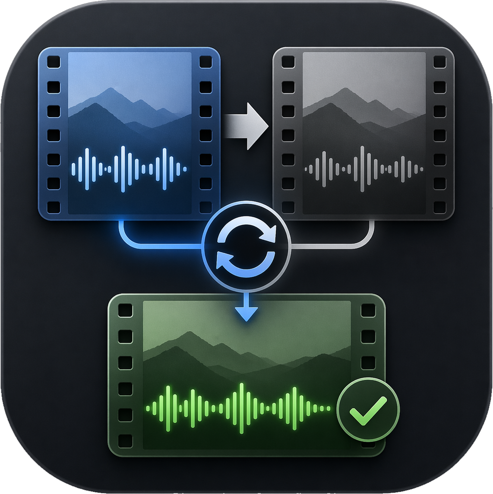

# MKV Commentary Sync

<p align="center">
  
</p>

Adds commentary or dub tracks from one MKV edition of a film to another edition, with timing offset and simple linear drift automatically detected and corrected.

Different releases of the same film often have slightly different runtimes — longer studio logos, alternate intros, frame-rate speed differences, or minor editorial changes. Naively dropping an audio track into the wrong edition can start in sync but drift out over time. This tool compares reference audio from both files, measures the offset, applies timestamp drift correction when the mismatch is linear, and muxes the selected source track(s) into the target. No audio or video is re-encoded.

---

## Download

**[→ Download the latest release](../../releases/latest)** — grab the binary for your platform from the Assets section. No Python installation required.

| Platform | File |
|---|---|
| Windows | `mkvsyncdub-windows.exe` |
| macOS | `mkvsyncdub-macos` |
| Linux | `mkvsyncdub-linux` |

> **macOS:** The first time you open the app, macOS will block it because it isn't notarized. Right-click the file → **Open** → **Open** to bypass this once. After that it opens normally.
>
> **Linux:** Make the binary executable before running: `chmod +x mkvsyncdub-linux`

---

## External requirements

The tool requires two external binaries. **These are not bundled** — they must be installed separately.

| Tool | Purpose | Windows | macOS | Linux |
|---|---|---|---|---|
| **ffmpeg** | Audio extraction and frame-rate detection | `winget install Gyan.FFmpeg` | `brew install ffmpeg` | `sudo apt install ffmpeg` |
| **MKVToolNix** (`mkvmerge`) | Track identification and muxing | `winget install MKVToolNix.MKVToolNix` | `brew install mkvtoolnix` | `sudo apt install mkvtoolnix` |

Both must be on PATH, or their paths set manually in the Advanced panel. The path fields accept either the executable itself (for example `C:\Program Files\MKVToolNix\mkvmerge.exe`) or the install folder that contains it (for example `C:\Program Files\MKVToolNix`).

On Windows, if you're using the standalone `.exe`, the GUI will detect missing tools on launch and offer a **Download ffmpeg** button (automated) and a **Get MKVToolNix** button (opens the download page).

---

## Running from source

```
pip install -r requirements.txt
```

**GUI** (no arguments):
```
python main.py
```

In the GUI:

1. Choose the **source** file that contains the audio track(s) you want to copy.
2. Choose the **target** file that should receive those track(s).
3. Pick one source and one target **Reference Track** for sync detection. Use matching-language tracks when possible.
4. Check one or more **Tracks to Mux** from the source file.
5. Click **Analyze & Mux**.

**CLI:**
```
python main.py --source <source.mkv> --target <target.mkv> [options]
```

---

## Building the standalone binaries

Releases are built automatically via GitHub Actions on every version tag — no local build needed to ship.

To build locally on Windows:
```
build.bat
```
Output: `dist/mkvsyncdub.exe`

### App icon assets

Drop your icon files into `assets/icons/` using these names:

- `app_icon.png` for the runtime window icon when running from source and in packaged builds.
- `app_icon.ico` for the embedded Windows `.exe` icon.
- `app_icon.icns` if we later switch the macOS release to a native `.app` bundle.

Because both `build.bat` and the GitHub release workflow build through `mkvsyncdub.spec`, the same icon assets are used in both places automatically.

The GitHub repository page icon itself is not controlled by the repo files. To brand that side too, set the repo or org avatar and the repository social preview image in GitHub settings.

---

## CLI options

If `--track-id` is omitted, the CLI lists available source audio tracks and prompts you to choose. The CLI muxes one selected source track per run and uses the first audio track in each file as the sync reference. Use the GUI when you need to choose different reference tracks or mux multiple tracks in one pass.

| Option | Default | Description |
|---|---|---|
| `--source PATH` | — | MKV with the commentary track |
| `--target PATH` | — | MKV to mux the track into |
| `--track-id INT` | (prompt) | Track ID to mux (from `mkvmerge --identify`) |
| `--output PATH` | `<target>_with_commentary.mkv` | Output file path |
| `--sample-start INT` | `120` | Seconds into the film to begin sampling (skips logos) |
| `--sample-duration INT` | `300` | Seconds of audio to use per sample point |
| `--sample-rate INT` | `8000` | Sample rate for correlation audio (Hz) |
| `--ffmpeg-path PATH` | `ffmpeg` | Path to ffmpeg binary |
| `--mkvmerge-path PATH` | `mkvmerge` | Path to mkvmerge binary |
| `--dry-run` | — | Print the detected offset and mkvmerge command without executing |
| `--verbose` | — | Print detailed progress |

---

## How it works

**Step 1 — Frame rate check.** ffprobe reads the video frame rate from both files. Matching frame rates usually mean a fixed delay is enough. A mismatch (> 0.01 fps), such as 24.000 vs. 23.976, is treated as a drift hint instead of an automatic failure.

**Step 2 — Reference-track correlation.** The tool extracts short mono audio segments from the selected reference tracks. In the GUI, these can be any source/target audio tracks; in the CLI, they default to the first audio track in each file. Each sample uses normalized cross-correlation to find the lag where both waveforms best align.

**Step 3 — Multi-point drift detection.** The tool samples up to five points across the shorter file. If the offsets are effectively constant, their median becomes the final delay. If they follow a line, the tool fits `offset(t) = slope * t + base` and converts the slope into an `mkvmerge --sync` timestamp ratio. This handles simple uniform speed differences without re-encoding.

**Step 4 — Consistency check.** If offsets do not fit either a constant delay or a linear drift model, the editions likely differ mid-film (extended scene, alternate cut, missing logo, etc.). In that case, a single delay or stretch cannot reliably fix the whole file.

**Step 5 — Mux.** mkvmerge stream-copies all tracks from the target, then appends the selected source track(s) with `--sync <id>:<offset_ms>` or `--sync <id>:<offset_ms>,<ratio>` when drift correction is needed. No audio or video is decoded or re-encoded.

### Sign convention

| Offset | Meaning | mkvmerge effect |
|---|---|---|
| Positive | Source content starts later than target | Commentary delayed to match |
| Negative | Source content starts earlier than target | Commentary advanced to match |

### Notes on correlation confidence

The normalized cross-correlation (NCC) value reflects how similar the two audio waveforms are at each sample point. Different Blu-ray, WEB, stereo, and surround masters can have different loudness, EQ, channel layout, or dynamic range processing, which can push NCC well below 0.5 while still producing the correct lag. The default minimum is `0.02`; points below that are excluded.

If all sample points fail, the audio segments may be silent, the chosen reference tracks may not contain matching content, or the minimum may be too strict for those masters. In the GUI, try choosing a better-matching source/target reference track pair, adjusting **Sample Start** / **Sample Duration**, or lowering **Min. NCC** in Advanced.

---

## Adding multiple audio tracks

The GUI can mux multiple selected source audio tracks in one run. All selected tracks receive the same detected delay and drift correction, so this works best when those source tracks are already internally synchronized with each other.

The CLI muxes one source audio track per run. To add more than one track from the CLI, run it repeatedly and use the previous output as the next target:

```bash
python main.py --source src.mkv --target target.mkv --track-id 2 --output pass1.mkv
python main.py --source src.mkv --target pass1.mkv --track-id 3 --output final.mkv
```

---

## Project structure

```
mkv-commentary-sync/
├── main.py                 # Entry point — GUI if no args, CLI otherwise
├── core/
│   ├── detect_offset.py    # Audio extraction + cross-correlation
│   ├── downloader.py       # ffmpeg auto-download, MKVToolNix browser link
│   ├── track_utils.py      # mkvmerge --identify parsing, ffprobe helpers
│   └── mux.py              # mkvmerge command construction + execution
├── gui/
│   ├── main_window.py      # PySide6 main window
│   └── worker.py           # QThread pipeline worker
├── tests/
│   └── test_drift_math.py  # Regression tests for drift correction math
├── .github/workflows/
│   └── release.yml         # Builds Windows/macOS/Linux binaries on tag push
├── mkvsyncdub.spec         # PyInstaller build spec
├── build.bat               # Local Windows build script
└── requirements.txt
```
